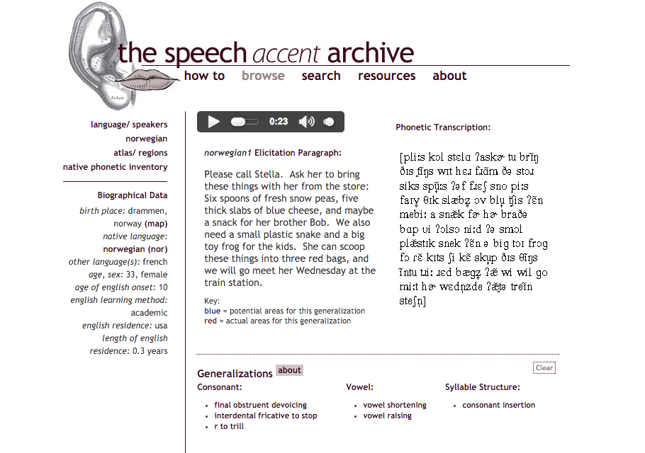
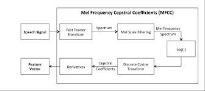
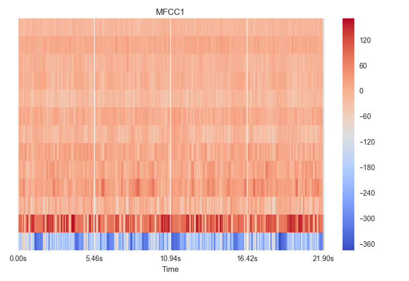

# Accent Classification in Spoken English

This repo contains the code, images and .csv files for my accent classification project. The goal of this project is to train a neural network to distinguish and classify the accents of English speakers from different geographic and linguistic backgrounds. The code section includes python files both for preprocessing of audio files into useful data objects and models of neural net classifiers.

## Table of Contents
1. [Motivation](#motivation)
2. [Dataset](#dataset)
3. [Signal Processing](#signal-processing)
4. [Features from MFCCs](#features)
5. [Neural Network Models](#models)
    * [1D Convolutional Neural Net](#1dconvnet)
    * [LSTM Recurrent Neural Net](#rnn)
    * [Results](#results)
6. [Future Directions](#future-directions)

## Motivation

The motivation behind developing a model to recognize accents in spoken English is primarily twofold. First, if it is possible to determine a speaker's geographic location or native language simply by their accent, then it might be possible, for instance in a call center, to more efficiently route that person to a regional representative or to a speaker of an appropriate language. Secondly, accent recognition is simply a necessary precursor to automatic speech recognition (ASR), such as is found in Siri--to understand what a person is saying, there must be a model in place that expects how they are going to say it.

The decision to use neural networks to tackle this problem, which has frequently been approached with other methods in the past, was one done for the sake of novelty and because nets perform well for a variety of media classification tasks.

## Dataset

All of the speech files used for this project come from the [Speech Accent Archive](http://accent.gmu.edu), a repository of spoken English hosted by George Mason University. Over 2000 speakers representing over 100 native languages read a common elicitation paragraph in English:

>Please call Stella.  Ask her to bring these things with her from the store:  Six spoons of fresh snow peas, five thick slabs of blue cheese, and maybe a snack for her brother Bob.  We also need a small plastic snake and a big toy frog for the kids.  She can scoop these things into three red bags, and we will go meet her Wednesday at the train station.

The common nature of the dataset makes it ideal for studying accent, being that the wording is provided and the recording quality is (nearly) uniform across all speakers.

 <b> Figure 1: </b> Example [speech accent archive](http://accent.gmu.edu) page for a speaker, including the audio file, a phonetic transcription of their reading, as well as biographical data. 

For each of the bigger languages (defined by me as having at least 10 speakers represented in the dataset), I scraped the site and saved the mp3 files to folders and the biographical data to [csv files](https://github.com/dwww2012/Accent-Classifier/tree/master/dataframes)--for manipulation using Pandas DataFrames.

## Signal Processing

Having saved all the .mp3 files, I then converted them to .wav files, being that this is a more universal (and less compressed) format for audio processing. (Functions used in this process of audio retrieval and ordering can be found in my **code** directory  [here](https://github.com/dwww2012/Accent-Classifier/tree/master/code/mp3_getter.py).)

The .wav files themselves are routinely visualized as waveforms such as this:

 <b> Figure 2: </b> Waveform for the 'english1' file, showing speech power over time (roughly 20 seconds). 

Depicted here is the graph of a numerical representation of a 21 second audio file, corresponding essentially to energy (i.e. pressure) on the y-axis and time on the x-axis. Being that the sample rate is set at 44100 samples/sec, this gives us a 1-dimensional vector of nearly 1 million values in less than 30 seconds!

Attempts were made to process that raw data, but passing a vector with of order 1 million features into a machine learning algorithm seemed intractable. One attempt was to downsample (i.e., reduce the sampling rate) of the audio. To arrive at a reasonable number of features, however, meant losing almost all recognizable speech signal, let alone accent information, contained in the file. Thus it was necessary to use a lower-dimensional but more highly significant feature space to represent the speech files.

## Features from MFCCs

To featurize the audio files, I used mel frequency cepstral coefficients (MFCCs), which are a decades old tool for representing human speech as it is perceived. Quoting from [practical cryptography](http://practicalcryptography.com/miscellaneous/machine-learning/guide-mel-frequency-cepstral-coefficients-mfccs/),
> The main point to understand about speech is that the sounds generated by a human are filtered by the shape of the vocal tract including tongue, teeth etc. This shape determines what sound comes out. If we can determine the shape accurately, this should give us an accurate representation of the phoneme being produced. The shape of the vocal tract manifests itself in the envelope of the short time power spectrum, and the job of MFCCs is to accurately represent this envelope.

This is achieved through six steps:
1. Frame the signal into short frames.
2. For each frame calculate the periodogram estimate of the power spectrum.
3. Apply the mel filterbank to the power spectra, sum the energy in each filter.
4. Take the logarithm of all filterbank energies.
5. Take the DCT of the log filterbank energies.
6. Keep DCT coefficients 2-13, discard the rest.

 <b> Figure 3: </b> Schematic representation of the steps necessary to create a Mel frequency cepstral coefficient (MFCC) from an audio signal. 

The output of this process is a 13-dimensional vector, each dimension corresponding to a different band in human hearing.

 <b> Figure 4: </b> Visual representation of the 13 MFCCs for the 'english1' audio file over ~22s.  

In my data, being that every speech instance was different, I had to normalize all of them to some standard, so that the MFCCs had the same dimensions. I chose to trim/pad them all to be ~30 seconds in length. Thus given that my MFCC moving window is 0.1s, this yielded MFCCs of shape (2999, 13).

Code necessary for the creation of these features and other pre-processing to feed into my model(s) can be found [here](https://github.com/dwww2012/Accent-Classifier/tree/master/code/testing.py).

## Neural Network Models

The problem of machine learning accent recognition has traditionally been handled with some combination of support vector machines (SVMs), hidden Markov models (HMMs), Gaussian mixture models (GMMs) and dynamic time warping (DTW). These tools allow machines to arrive at the most important features of speech, controlling for inherent temporal variation.

I found the prospect of a neural network appealing in that it can train itself to learn the important features without needing to controlling explicitly for time--that is, the difference in speaking pace between two speakers needn't necessarily be controlled for (as with DTW), because a convolutional or recurrent net will update its weights across a sequence of any length.

### 1D Convolutional Neural Net

Two-dimensional convolutional neural networks (CNNs) are increasingly used as the go-to machine learning algorithm for computer vision--i.e., recognizing an image. Less used but no less powerful--in their domain of application--are 1D CNNs, which are especially suited for text or time-series data, such as mine. The key underlying trait of convolutional nets is that they are spatially (or temporally) invariant, and thus inherent variation in speech patterns is controlled for by the convolutions and pooling.

My [CNN model](https://github.com/dwww2012/Accent-Classifier/blob/master/code/conv_1d_model_aws.py) was built on top of the [Keras](http://keras.io) deep learning Python package and largely based on a [text processing example](https://github.com/fchollet/keras/blob/master/examples/imdb_cnn.py). I performed many adjustments on my net depending on how many and which accents I was modeling. In its current form, it features six convolutional layers with batch normalization after each to control for weights veering too far from (0,1) and MaxPooling after all but the first convolution.

The model was trained on (generally) 85% of my data, using either full (2999, 13)-dimensional MFCCs or else split (5, 999, 13)-dimensional MFCCs, where each 30 second file is split into 5 overlapping 10 second files. This latter split was used simply to give me 5 times more training samples in the case of small data.

### LSTM Recurrent Neural Net

Another, potentially more promising, variety of neural network I was eager to try was the recurrent neural net (RNN). Specifically, I implemented a long short-term memory (LSTM) RNN.  RNNs generally are nets wherein the weights are updated *between* hidden cells in the same layer, and these updates occur recurrently for passed in sequences (such as time-varying speech signal data!). An LSTM is a specific version of RNN that employs *memory cells* to preserve data throughout the sequence of unknown duration, such as ours.

Again, my [LSTM RNN model](https://github.com/dwww2012/Accent-Classifier/blob/master/code/rnn_example.py) was built on top of Keras. It features three LSTM layers and again feeds in (n, 999, 13)-dimensional MFCCs as its inputs. The model can be passed as either 'stateful' or not, meaning that the last state for each sample at index i in a batch will be used as initial state for the sample of index i in the following batch--in this case, the 3-dimensional batch size must be passed explicitly into the model's first layer.

### Results

After training both the CNN and RNN on the top 5 most common languages--those being English, Spanish, Arabic, Mandarin, and French--my best results were ~86% precision for US English classification. Other languages lagged behind, with Arabic, Spanish and Mandarin in the 65-75% range and French performing especially poorly. Focusing only on the top three languages, my RNN outperformed my CNN, yielding **accuracy and recall of 75%+ for English, Spanish and Arabic**.

## Future Directions

Going forward, my I would like to improve my net(s) so that they can distinguish more languages more reliably. That most likely will entail building deeper nets. Moreover, it is likely that I will simply need more and better data to do that. My training sets are on the order of hundreds of observations, which are very small numbers for a neural network. Moreover, many speakers have only faint accents. To train a model well, I would need to manually select only those speakers with a strong accent.

My ultimate goal is to build a live web app that take 'wild' (i.e., unstructured) speech audio and make a prediction of the age, gender and geographic location/language of the speaker.
